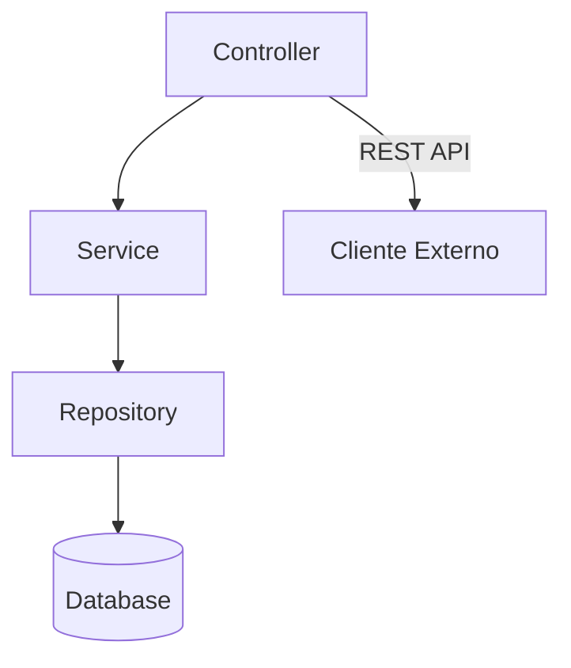

# 🚀  Tutorial Java Projeto Spring Boot – Documentação

📘 Guia oficial: https://spring.io/guides/tutorials/rest

  
  
  
  

---

## 📚 Sumário

### ✅ Inicialização
- **[Spring Initializr](docs/spring-initializr.md)**  

### 🌐 API
- **[Controller](docs/api-controller.md)**  
- **[Endpoints (rotas)](docs/endpoint.md)**  
- **[OpenAPI](docs/openapi.md)**  
- **[API Versioning](docs/api-versioning.md)**  

### ✅ Padrões HTTP
- **[HTTP Status Codes](docs/http-status-code.md)**  

### 🏗 Camada de Negócio
- **[Service](docs/service.md)**  

### 🗄 Banco de Dados
- **[Database](docs/database.md)**  
- **[Spring Data Repository](docs/repository.md)**  
- **[Spring Data Relationships](docs/data-relationships.md)**  
- **[Spring Data Projections](docs/data-projections.md)**  
- **[Pagination & Sort](docs/data-pagination.md)**  
- **[Migrations (Flyway)](docs/migrations.md)**  
- **[Spring List Of Values](https://github.com/acnaweb/spring)**

### 🛠 Utilitários
- **[Optional](docs/optional.md)**  
- **[Streams (List<?>)](docs/streams.md)**  
- **[Lombok](docs/lombok.md)**  
- **[DTO Mapper](docs/dtos.md)**  

### 🛡 Segurança & Validação
- **[Validation](docs/validations.md)**  
- **[Exception Handler](docs/exception-handler.md)**  
- **[Security](docs/security.md)**  

### ⚙️ Configurações Avançadas
- **[Spring Profiles](docs/profiles.md)**  
- **[Cache](docs/cache.md)**  
- **[Feature Flag](docs/feature-flag.md)**

### 🐳 Deploy
- **[Dockerfile](docs/docker.md)**  
- **[Docker Compose](docs/docker-compose.md)**  

### 🔗 Integrações
- **[Webhook](docs/webhook.md)**  
- **[Kafka](docs/kafka.md)**  

### 🧪 Testes
- **[Unit Tests](docs/unit-test.md)**  
- **[Unit Tests (Controller)](docs/unit-test-controller.md)**  
- **[Integrated Tests](docs/integrated-tests.md)**  

### 🔍 Qualidade de Código
- **[Code Quality](docs/code-quality.md)**  

---

## ⚡ Como Executar o Projeto

### ✅ Via Maven
```bash
mvn spring-boot:run
```

### ✅ Via Docker
```bash
docker build -t meu-app .
docker run -p 8080:8080 meu-app
```

### ✅ Via Docker Compose
```bash
docker-compose up --build
```

---

## 📐 Diagrama da Arquitetura (Mermaid)



---

## 🔗 Endpoints Principais (Exemplo)

| Método | Rota                | Descrição             |
|--------|----------------------|----------------------|
| GET    | `/api/v1/produtos`  | Lista todos produtos |
| GET    | `/api/v1/produtos/{id}` | Busca por ID       |
| POST   | `/api/v1/produtos`  | Cria um novo produto |
| PUT    | `/api/v1/produtos/{id}` | Atualiza produto   |
| DELETE | `/api/v1/produtos/{id}` | Remove produto     |

---

## ✅ Testes
Rodar testes unitários:
```bash
mvn test
```

---

# Diversos

## Deploy Manual to Cloud

Opções:
- Google Cloud Run
- AWS Elastic Beanstalk
- Azure App Service

## Continuous Integration / Delivery / Deployment

Ferramentas:

- GitHub Actions
- Jenkins
- GitLab CI/CD

## Api Gateway

Utilize:

- Spring Cloud Gateway
- Kong
- NGINX

Configuração de roteamento e segurança de entrada.
